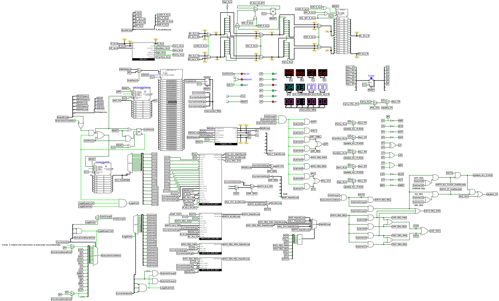

# My 8-bit CPU

This 8-bit CPU represents a unique project where I designed and imagined a custom 8-bit processor. It showcases my vision of how a simple yet functional processor can be built and simulated.

## Features

-   **8-bit Data Bus**: The CPU processes 8-bit instructions and data, ideal for simple computation tasks.
-   **Instruction Set Architecture (ISA)**: A custom instruction set has been designed to control the CPU, allowing for operations like addition, subtraction, logical operations, and jumps.
-   **Logisim Implementation**: The design is implemented using Logisim, a graphical tool for designing and simulating logic circuits. You can visualize the entire flow of instructions and data in the system.
-   **Control Unit & ALU**: The CPU contains a basic ALU (Arithmetic Logic Unit) and a control unit to manage the execution of instructions.
-   **Verilog**: To complement the Logisim implementation, the CPU is also described in Verilog for hardware simulation and synthesis. This Verilog implementation can be used to simulate the CPU in digital design tools or synthesize it for FPGA/ASIC design.

## Instruction set manual

A detailed description of the instruction set can be found in the [Instruction Set Manual](https://github.com/sherif-ibn-nasser/my-8-bit-cpu/blob/main/My%208-bit%20CPU%20Instruction%20Set%20MANUAL.pdf), which includes:

-   **Basic Instructions**: Load, move, and arithmetic operations.
-   **Control Flow Instructions**: Jump, conditional branches, etc.
-   **Logical Operations**: AND, OR, NOT, XOR, etc.

## Full screenshot

Below is a full screenshot of the 8-bit CPU design in Logisim:



This image shows the entire layout of the CPU, including the control unit, ALU, data bus, and more.

## Demo

You can see the CPU in action by watching the [demo](https://www.youtube.com/watch?v=4WbbHC1_2LM).

The video shows the execution of a sample program written in machine code using the [instruction set](https://github.com/sherif-ibn-nasser/my-8-bit-cpu/blob/main/My%208-bit%20CPU%20Instruction%20Set%20Manual.pdf).

## Scripts

The [scripts](scripts) folder includes Python scripts that show the state of the ALU and RH register (for remainder) during each clock cycle of [`mul`](scripts/mul.py) (multiplication) and [`div`](scripts/div.py) (division) instructions.

## Verilog

The CPU is also implemented in Verilog for simulation and potential FPGA synthesis. This version mirrors the Logisim design, enabling hardware-level testing and implementation.

### Key components:

-   **Top Module (`cpu.v`)**: Integrates the core, ALU, registers, and memory.
-   **Core**: Handles the fetch-decode-execute cycle.
-   **ALU**: Handles arithmetic and logical operations with flag outputs.
-   **Register File**: Manages 8-bit general-purpose registers.

### Testbenches:

1. Clone the repository:
    ```bash
    git clone https://github.com/sherif-ibn-nasser/my-8-bit-cpu.git
    ```
2. Navigate to `verilog` folder and simulate:
    ```bash
    cd my-8-bit-cpu/verilog
    iverilog -o cpu_sim cpu_tb.v
    vvp cpu_sim
    ```
3. View the results in GTKWave:
    ```bash
    gtkwave cpu_wave.vcd
    ```

Full Verilog code and testbenches are in the [verilog folder](https://github.com/sherif-ibn-nasser/my-8-bit-cpu/tree/main/verilog).

## How to run

1. Download and install [Logisim](https://github.com/logisim-evolution/logisim-evolution).
2. Clone the repository to your local machine.
3. Open the project file (`cpu.circ`) in Logisim.
4. Follow the [Instruction Set Manual](https://github.com/sherif-ibn-nasser/my-8-bit-cpu/blob/main/My%208-bit%20CPU%20Instruction%20Set%20Manual.pdf) to write your program
5. Write your program as a text file in the form of machine code as in [this example](https://github.com/sherif-ibn-nasser/my-8-bit-cpu/blob/main/example)
6. Simulate the CPU and observe the results of various instructions by stepping through the execution cycle.
